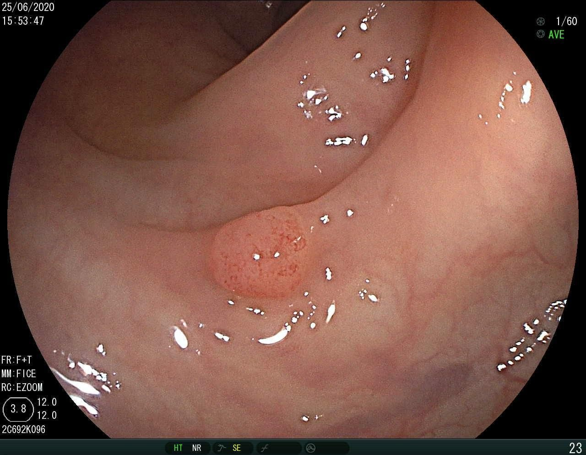

# BKAI-IGH-NeoPolyp-Segmentation

## Instructions 
It is recommended that you install the required libraries/packages first for convienent grading process :D

```pip install -r requirements.txt```

Please run the inference code by the following instructions:

```python infer.py --image_path /path/to/image.jpeg``` 

Where the /path/to/image/jpeg should be recommended to be the ABSOLUTE path (E.g: /mnt/d/path/to/image.jpeg)

## Example input image

```python infer.py --image_path resources/example_image.jpeg```

<p align="center">
  
</p>
<p align="center">
   <em>Example of input image</em>
</p>

## Masking of the example input image

It is stored at "resources/saved_segmentation.jpeg"

<p align="center">
  
</p>
<p align="center">
   <em>Mask output of the input image</em>
</p>
